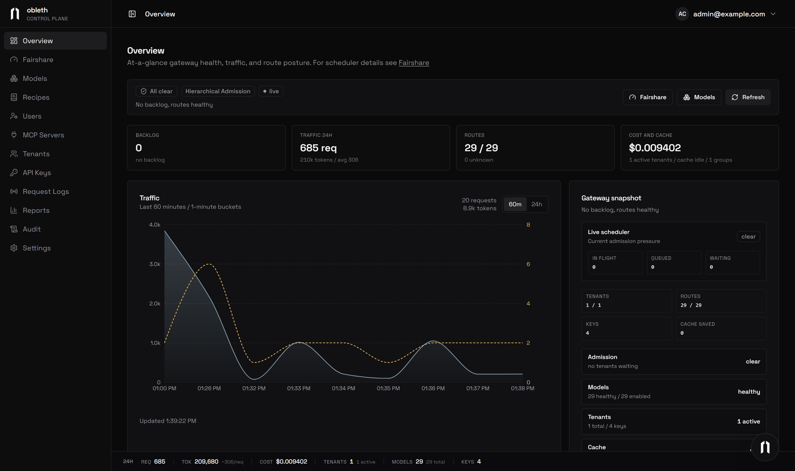
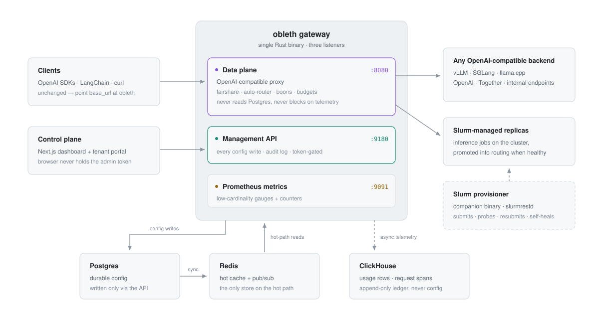
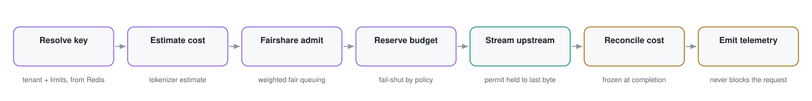
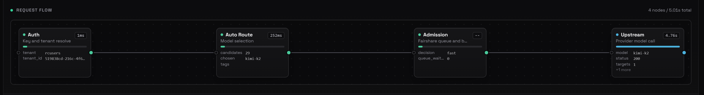
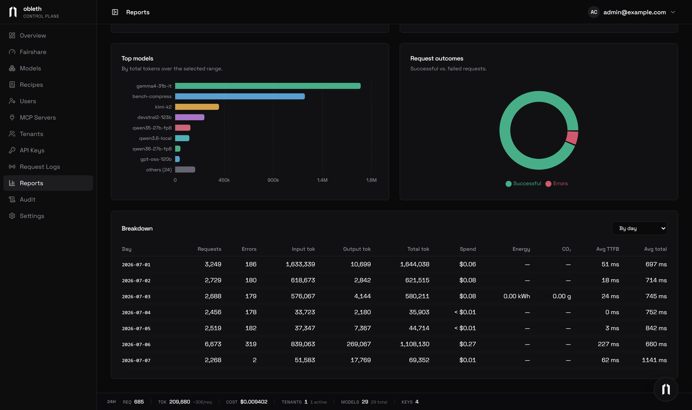
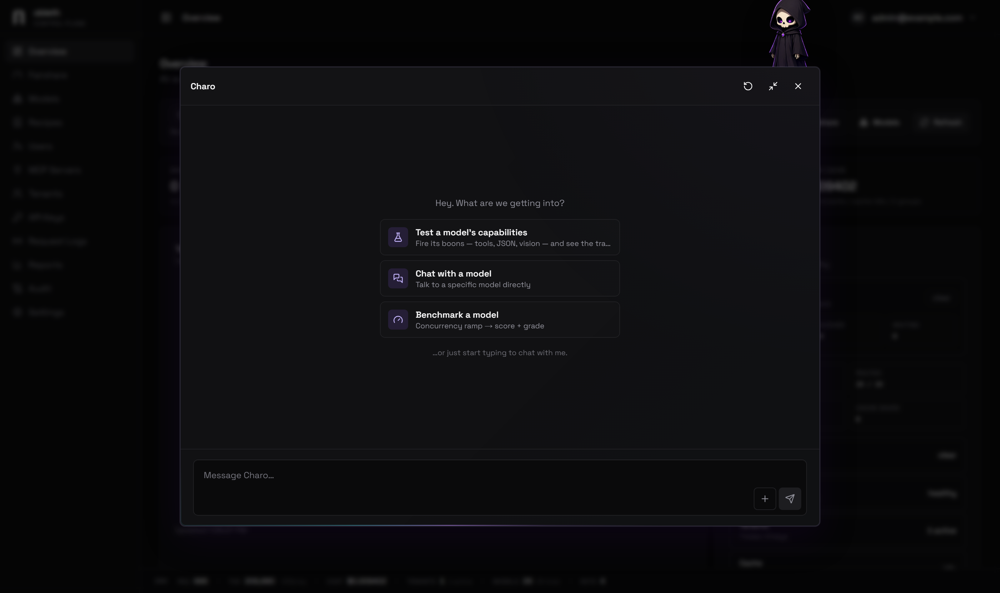

# obleth-gateway

[](https://github.com/thediymaker/obleth-gateway/actions/workflows/ci.yml)
[](https://github.com/thediymaker/obleth-gateway/releases)
[](LICENSE)
[](https://www.rust-lang.org/)

**obleth is a multi-tenant AI gateway for shared GPU infrastructure — university clusters, on-prem deployments, and cloud.**



Point your clients at obleth and register your models. The gateway adds identity, weighted fairshare admission, automatic model selection, health verification, and cost, energy, and chargeback accounting on top of any OpenAI-compatible backend — vLLM, SGLang, llama.cpp, OpenAI, Together, or your own servers. On HPC clusters, a companion Slurm provisioner submits, monitors, and routes to inference jobs automatically. Clients keep their existing OpenAI SDKs; only the base URL changes.

<picture>
  <source media="(prefers-color-scheme: dark)" srcset=".github/assets/architecture-dark.svg">
  
</picture>

The design keeps the request path independent of everything that can fail around it: the data plane reads configuration only from Redis and in-process caches (never Postgres), telemetry is written asynchronously and spills to a local WAL if ClickHouse is down, and optional helpers fail open. A Postgres, ClickHouse, or sidecar outage degrades freshness or accounting — never request serving.

## Scheduling and routing

**Weighted fairshare admission.** A purpose-built weighted fair-queuing scheduler controls admission. Each tenant has a weight; when demand exceeds capacity, throughput divides proportionally, so no tenant can starve another. Tenants can be organized into groups — capacity splits between groups first, then among tenants within each group. Weights and group assignments update live, with no restart.

**Automatic model selection.** Send `model: "auto"` and obleth picks the best available model from the registered fleet. Hard filters remove models that are down, over capacity, or missing a required capability (function calling, JSON schema, context window); remaining candidates are scored by spare capacity and cost. An optional small-model classifier maps requests to intent tags (`coding`, `reasoning`, `vision`, `long-context`, …) to prefer the right specialist, with heuristics as fallback.

**Model boons.** Runtime-toggleable capabilities the gateway grants to models that lack native support. **Vision** relays image parts to a designator model and substitutes the description. **Structured output** enforces `response_format` JSON schemas and optionally repairs the response. **Gateway tool loop** injects registered MCP server tools into plain chat requests and executes the calls until a final answer, streamed live. **Context compression** compacts oversized JSON, logs, and repeated context before they reach the model — losslessly by default, with an optional self-hosted neural sidecar for prose. Every boon fails open: any error leaves the request unchanged.

**Live configuration.** Model weights, tenant weights, rate limits, budgets, boon settings, and health windows take effect immediately from the dashboard or Management API. The data plane reads from an in-process cache refreshed in the background; there is no hot-path coupling to the control plane.

Every request follows the same pipeline, and each stage is visible in the per-request trace below:

<picture>
  <source media="(prefers-color-scheme: dark)" srcset=".github/assets/pipeline-dark.svg">
  
</picture>

## Operations and health

**Health checks that match the model type.** Chat, embedding, speech, transcription, and image models are each verified against their real modality endpoint — a minimal inference probe, not a generic ping. A rejected probe with the model still listed in the upstream's catalog is reported as a likely misconfiguration instead of an outage; a model genuinely missing upstream alerts with catalog evidence. Fixing a model's connection settings clears stale failure state and re-checks within seconds.

**Per-request flow view.** Every request can be traced through the gateway's own span recorder: auth resolve, auto route, fairshare admission, boon execution, upstream call. The dashboard renders the trace as a node graph with durations and attributes on each step. No external collector is required — spans land in ClickHouse next to usage data, and OTLP export is available for Jaeger or any OpenTelemetry backend.



**Slurm provisioner.** A companion service manages inference servers on HPC clusters via `slurmrestd`: it submits jobs, health-probes each replica, promotes healthy ones into the routing table, and resubmits when jobs are preempted. Fresh replicas are warmed with a throwaway request before they take real traffic. Zombie jobs — RUNNING in Slurm but dead or hung at inference — are detected on two independent signals and restarted automatically, capped at one restart per model per tick. When the provisioner can't reach Slurm, the dashboard says so loudly instead of showing stale state as healthy.

**Local-first network posture.** Private, LAN, and loopback addresses are valid upstream targets out of the box — no allowlist needed for cluster-internal endpoints. Link-local and cloud-metadata ranges are always blocked. `OBLETH_BLOCK_PRIVATE_NETWORKS=1` enables strict mode with explicit CIDR exceptions.

## Cost, energy, and chargeback

**Frozen-at-completion accounting.** Cost is computed once when a request settles and stored on the usage row. Changing prices later never rewrites history — reports stay consistent with what tenants were actually charged.

**Budgets and rate limits.** Per-tenant and per-key budgets are reserved at admission, before dispatch, and reconciled to actual usage at completion. Budget enforcement is the one deliberately fail-closed decision in the gateway.

**Energy and carbon per request.** Point the gateway at your Prometheus with any PromQL expression returning per-node power — Habana, DCGM, and IPMI exporters all work — and each request is charged its wall-time share of a serving slot's draw: watt-hours, electricity cost, and CO₂, recorded next to token cost. Queue time is never charged and idle power is never attributed, so totals understate rather than overstate. Off by default; if Prometheus is unreachable, requests are never delayed.

**Chargeback reports.** Historical usage filtered by team and key, grouped by day, team, key, or model, with spend on every row and CSV export that carries exactly the columns and filters you're looking at.



## Benchmarking and testing

**`obench score`.** A graded readiness scorecard for the whole deployment. Six sections — capacity ramp, gateway overhead, streaming quality, overload behavior, resilience (fault-injected MTTD/MTTR), and fairshare dynamics — roll up into a weighted, letter-graded report. Scores are stored as baselines and diffed on later runs to catch regressions. A GPU-free fixture backend ships in the compose stack, so the full suite runs without touching real models.

**Charo.** An agentic model-testing console built into the dashboard. Charo carries a prompt to any configured model and returns the answer with its cost: latency, token counts, and which boons actually fired. Guided activities probe a model's capabilities, chat with a specific model through the gateway, verify MCP servers end-to-end, or run a concurrency-ramp benchmark with knee detection and a graded capacity curve — rendered inline in the conversation.



**Synthetic tenants.** Tenants can be flagged synthetic (obench seeds its fixture tenants that way). Their traffic is recorded as benchmark traffic and, together with health probes, excluded from usage and cost statistics by default — test runs never pollute the numbers you bill against.

## Quick start (Docker)

```bash
cd deploy/docker
cp .env.example .env          # dev defaults — change passwords before exposing to a network
docker compose up -d
```

`.env.example` enables the full dev/demo stack (`benchmark`, `edge`, and `observability` profiles), so everything starts with a single command. To build from source instead of pulling published images, add `--build`.

Once the containers are healthy:

| Service | URL | Default login |
| --- | --- | --- |
| Dashboard | <http://localhost:3002> | `admin@example.com` / `obleth-admin` |
| Gateway (via HAProxy) | <http://localhost> | — |
| Gateway (direct) | <http://localhost:8088> | — |
| Grafana | <http://localhost:3001> | `admin` / `obleth` |
| Prometheus | <http://localhost:9090> | — |
| Jaeger traces | <http://localhost:16686> | — |

The dashboard login comes from `DASHBOARD_ADMIN_EMAIL` and `DASHBOARD_PASSWORD` in your `.env`; OIDC SSO (Globus, CILogon, or any discovery-capable provider) is also supported. If you are upgrading from a pre-v0.5.0 username login, set `DASHBOARD_ADMIN_EMAIL` before upgrading — see the [Dashboard SSO guide](https://obleth.com/docs/guides/dashboard-sso).

Log in to register models, create tenants and API keys, configure fairshare weights, and monitor usage. The benchmark fixture backend is pre-registered as the default upstream, so the UI is explorable immediately without a GPU endpoint. Models can also be imported in bulk from any OpenAI-compatible provider's catalog.

## Deployment

obleth ships as Docker Compose (above), a Helm chart for Kubernetes, and pre-built binaries. Versions are released in lockstep across the gateway, dashboard, provisioner, and chart. See **[obleth.com](https://obleth.com)** for deployment guides, the configuration reference, and production setup.

## Documentation

Architecture, scheduler internals, Slurm provisioner setup, auto routing and the classifier, budgets, boons, compression, energy accounting, MCP integration, alerting, and the configuration reference live at **[obleth.com](https://obleth.com)**.

## Contributing

Bug reports and feature requests go in [GitHub Issues](https://github.com/thediymaker/obleth-gateway/issues). Pull requests are welcome — see [CONTRIBUTING.md](CONTRIBUTING.md) for the development workflow. For security vulnerabilities, follow the responsible disclosure process in [SECURITY.md](SECURITY.md).

## License

[Business Source License 1.1](LICENSE). Source-available; each release converts to [Apache 2.0](https://www.apache.org/licenses/LICENSE-2.0) four years after publication. Free for internal, academic, research, and educational use. You may not offer obleth as a hosted service or distribute a competing gateway product derived from it until the Change Date. Contact the maintainers for commercial licensing.
