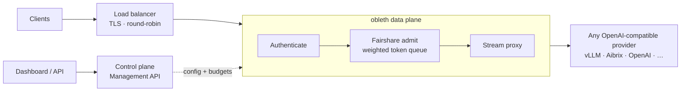

# obleth-gateway

[](https://github.com/thediymaker/obleth-gateway/actions/workflows/ci.yml)
[](LICENSE)
[](https://www.rust-lang.org/)

**obleth is the fair-queuing middleman between your users and your LLMs.**

Point your clients at obleth and obleth at any OpenAI-compatible provider. It owns
the layer load balancers and inference routers deliberately don't: **multi-tenant
identity, contention-based weighted fair queuing, token-accurate cost accounting,
and graceful degradation under load.**

```
   clients ──▶ obleth ──▶ any OpenAI-compatible provider
               │          (vLLM · Aibrix · OpenAI · Together · your own)
        who gets to send,
       at what priority, in
         whose fair share
```

The killer feature: **real-time fairshare with priority boosts.** Give your chatbot
key a weight boost so a flood of API or batch traffic can *never* choke it out — and
tune it live from the dashboard or API, no restart. When the fleet saturates, obleth
divides capacity **proportionally to tenant weight, measured in tokens**, with
starvation-free guarantees. Built in Rust, fail-open by design.

> **📚 Full documentation → [obleth.com](https://obleth.com)**

## Why obleth

Most self-hostable gateways (LiteLLM and friends) are provider-abstraction proxies
with per-key rate limits. Under heavy load they degrade unpredictably or fall over,
and none offer true contention-based weighted fairness for a shared GPU fleet.

obleth slots in front of whatever you already run — put any load balancer ahead of
it, point it at any OpenAI-compatible upstream behind it — and answers the one
question those tools don't: *when there isn't enough capacity for everyone, who
gets it?*

## Architecture

obleth is a thin Rust data plane on the request path, plus a control plane that
never touches the hot path.



The data plane authenticates the caller, decides admission against the weighted
fairshare scheduler, then streams the response — reconciling the true token cost
after the fact. Everything else (tenants, keys, weights, quotas, usage) lives in
the control plane and is pushed to the data plane out of band.

### Datastores (three, by design)
- **Postgres** — relational source of truth for config + audit (tenants, keys,
  weights, quotas, change history). Off the hot path.
- **Redis** — hot read-cache of resolved keys + atomic token-bucket budgets.
  The data plane reads only Redis.
- **ClickHouse** — append-only usage/cost ledger, async-inserted, never blocking
  a request.

Writes are single-sourced: **Management API → Postgres → Redis (sync + pub/sub
invalidate)**.

## The fairshare engine

- A single scheduler task owns admission (no lock races, deterministic order).
- A pluggable `CapacityProvider` sets the global in-flight budget. v1 is a
  runtime-tunable static limit; the trait is the seam for metrics-driven
  (vLLM/Aibrix queue depth, KV-cache util) or SLO-driven capacity later.
- Under contention, freed permits go to the tenant **most behind its weighted
  fair share** (start-time fair queuing). Higher `weight` = larger share; idle
  tenants can't bank credit and burst.
- Fairness is in **tokens**: estimate at admission, atomically reserve in Redis
  (Lua), reconcile the true cost after the stream completes.
- **Brownout, not 429**: under saturation low-priority traffic is degraded
  (capped `max_tokens`) instead of rejected.
- **Fail-open**: if Redis/ClickHouse blink, serve from the in-process key cache
  and spill telemetry to a WAL that replays on recovery.

## Quickstart (Docker)

```bash
docker compose -f deploy/docker/docker-compose.yml --profile benchmark --profile edge --profile observability up --build -d
```

Services: HAProxy (`:80`), obleth proxy (`:8080`), Management API (`:9090`),
metrics (`:9091`), dashboard (`:3000`), Postgres, Redis, ClickHouse,
benchmark fixture backend (`:8081`), Prometheus (`:9095`), Grafana (`:3001`).

Open the dashboard at <http://localhost:3000>.

### Create a tenant + key via the API

```bash
TOKEN=dev-admin-token
# create a boosted "chatbot" tenant
TID=$(curl -s -XPOST localhost:9090/api/v1/tenants \
  -H "Authorization: Bearer $TOKEN" -H 'Content-Type: application/json' \
  -d '{"name":"chatbot","weight":500,"tokens_per_minute":2000000}' | jq -r .id)

# mint a key (secret shown once)
SECRET=$(curl -s -XPOST localhost:9090/api/v1/tenants/$TID/keys \
  -H "Authorization: Bearer $TOKEN" -H 'Content-Type: application/json' \
  -d '{"name":"prod"}' | jq -r .secret)

# call the gateway
curl -s localhost:8080/v1/chat/completions \
  -H "Authorization: Bearer $SECRET" -H 'Content-Type: application/json' \
  -d '{"model":"benchmark-endpoint","messages":[{"role":"user","content":"hi"}],"max_tokens":32}'
```

Full API: `GET http://localhost:9090/api/v1/openapi.json`.

## Prove it: fairshare under load

```bash
node bench/run-benchmark.mjs
```

The benchmark seeds weighted tenants, runs staggered contention, samples the live
fairshare state, verifies ClickHouse usage, and exits non-zero if the fairshare
story is not visible. Add `CHAOS=1` to pause Redis and ClickHouse during the same
run. See [bench/README.md](bench/README.md).

## Kubernetes

```bash
helm install obleth deploy/k8s/obleth
```

Ships the obleth Deployment + HPA + Services, an optional ServiceMonitor, and
bundled demo dependencies. For production, point at CloudNativePG, an operator-
managed ClickHouse, and HA Redis (`postgres.enabled=false`, etc.).

## Configuration

obleth is configured entirely through environment variables. The essentials:

| Variable | Purpose |
| --- | --- |
| `OBLETH_UPSTREAM_BASE_URL` | your OpenAI-compatible provider (vLLM, Aibrix, OpenAI, …) |
| `OBLETH_DATABASE_URL` / `OBLETH_REDIS_URL` / `OBLETH_CLICKHOUSE_URL` | the three datastores |
| `OBLETH_ADMIN_TOKEN` | Management API bearer token (**required** — service refuses to start without it) |
| `OBLETH_FAIL_OPEN` | admit when Redis is down (default `true`; set `false` for strict multi-tenant) |

Secrets at rest, SSRF allow-lists, brownout tuning, Slack alerts, dashboard auth,
and the rest are documented in full at **[obleth.com](https://obleth.com)**. The
credentials in `*.env.example`, `docker-compose.yml`, and `values.yaml` are
**development examples only** — replace them and front the gateway with TLS before
deploying anywhere real.

## Repository layout

```
obleth/                 Rust workspace (data plane + management API)
  crates/obleth-config      shared config + domain types + key hashing
  crates/obleth-tokenizer   token counting + output estimation
  crates/obleth-fairshare   weighted fair-queuing admission scheduler
  crates/obleth-redis       hot cache + Lua budget scripts + pub/sub
  crates/obleth-store       Postgres config SoT + audit
  crates/obleth-telemetry   async ClickHouse writer + WAL fallback
  crates/obleth-admin       versioned Management API (axum + OpenAPI)
  crates/obleth-proxy       the `obleth` binary (3 listeners)
control-plane/        Next.js dashboard (consumes the Management API)
benchmark-backend/    OpenAI-compatible benchmark fixture backend
  bench/                benchmark harness
deploy/docker/        docker-compose + Dockerfiles + HAProxy/Prometheus
deploy/k8s/obleth/      Helm chart
schema/               Postgres + ClickHouse schema
```

Documentation lives at **[obleth.com](https://obleth.com)** (source in the separate
[obleth-docs](https://github.com/thediymaker/obleth-docs) repository).

## Development

```bash
cd obleth && cargo test --workspace        # unit + fairness tests (infra-free)
# integration tests run when OBLETH_TEST_DATABASE_URL / OBLETH_TEST_REDIS_URL are set
cd control-plane && npm install && npm run build
```

## Roadmap

Planned, not yet implemented:

- Metrics-driven `CapacityProvider` (vLLM queue depth / KV-cache utilization).
- Per-tenant SLO targets + attainment view.
- Real BPE tokenizer (tiktoken / HF) behind the existing `Tokenizer` trait.
- CLI + Terraform provider generated from the OpenAPI spec.

## License

[Elastic License 2.0](LICENSE) (ELv2). The codebase is **source-available**, not
OSI open source.

You may use, modify, and run obleth in production for your own workloads. You may
not provide the software to third parties as a hosted or managed service where
users get access to a substantial set of the gateway's features (see ELv2).
Contact the maintainers for alternative licensing.
