# obleth-gateway

[](https://github.com/thediymaker/obleth-gateway/actions/workflows/ci.yml)
[](https://github.com/thediymaker/obleth-gateway/releases)
[](LICENSE)
[](https://www.rust-lang.org/)

**obleth is a multi-tenant AI gateway for shared GPU infrastructure — university clusters, on-prem deployments, and cloud.**

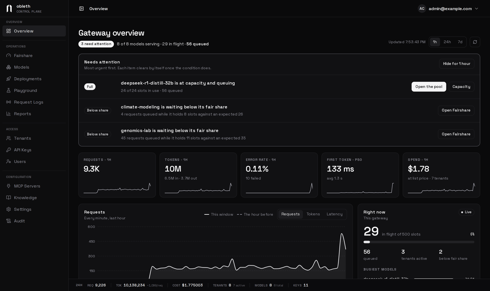

Point your clients at obleth and register your models. The gateway adds identity, weighted fairshare admission, automatic model selection, health verification, and cost, energy, and chargeback accounting on top of any OpenAI-compatible backend — vLLM, SGLang, llama.cpp, OpenAI, Together, or your own servers. On HPC clusters it launches models as Slurm jobs and keeps them running; on Kubernetes it sizes each model's pool from the replicas that are actually ready. Clients keep their existing OpenAI or Anthropic SDKs; only the base URL changes.

**One endpoint for every kind of model.** Chat and completions, the Responses API, embeddings, rerank, moderation, speech, transcription and translation, image generation, edits and variations, video jobs (the OpenAI Videos API), the Anthropic Messages API (so Claude Code works against your own models), MCP servers at `/mcp/<name>`, and typed decisions at `/v1/verdicts`. Every surface runs the same admission, budgets, guardrails, and accounting.

<picture>
  <source media="(prefers-color-scheme: dark)" srcset=".github/assets/architecture-dark.svg">
  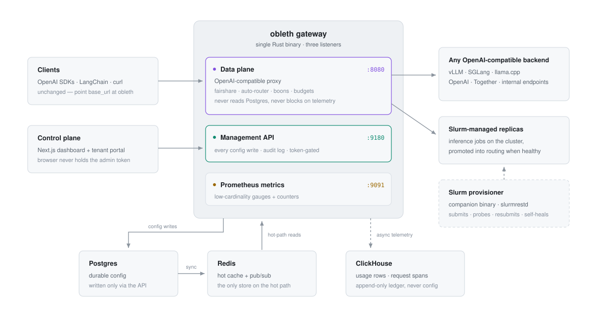
</picture>

The design keeps the request path independent of everything that can fail around it: the data plane reads configuration only from Redis and in-process caches (never Postgres), telemetry is written asynchronously and spills to a local WAL if ClickHouse is down, and optional helpers fail open. A Postgres, ClickHouse, or sidecar outage degrades freshness or accounting — never request serving.

## Scheduling and routing

**Weighted fairshare admission, per model.** A purpose-built weighted fair-queuing scheduler admits every request. Each model has its own pool, so a saturated model never delays one with free capacity, and usage on one model never costs a tenant priority on another. Inside a pool, capacity splits between groups, then tenants, then a tenant's keys, each by weight, so no tenant starves another and no user starves their team. With several gateway replicas the limits are cluster-wide slots in Redis, so any replica can use the whole of them. Weights and group assignments update live, with no restart.

**Pool sizes that follow the backend.** A model in `discovered` capacity mode takes its pool size from the replicas actually serving it (ready endpoints in a Kubernetes Service, or its registered endpoints), times a headroom factor, so the gateway's limit tracks the backend's own autoscaler instead of a number someone typed in.

**Automatic model selection.** Send `model: "auto"` and obleth picks the best available model from the registered fleet. Hard filters remove models that are down, over capacity, or missing a required capability (function calling, JSON schema, context window); remaining candidates are scored by spare capacity and cost. An optional small classifier model tags each request (`coding`, `reasoning`, `vision`, `long-context`, …) and rates its difficulty through single-token verdicts, so harder questions can go to stronger models; heuristics take over if it fails. The Playground's Router tab shows the whole decision for any prompt.

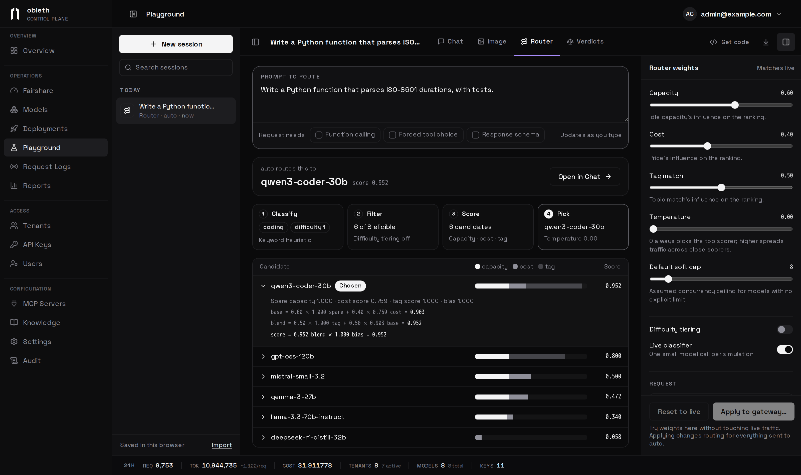

**Model boons.** Abilities the gateway adds to models that lack them, granted per model and composed per request. **Vision** describes images for text-only models. **Structured output** holds replies to a `response_format` JSON schema and repairs them if needed. **Tool loop** runs registered MCP server tools inside the gateway until a final answer, streamed live. **Image generation** lets a chat model draw through a registered image model. **Speculation** answers from a fast drafter when the target model agrees, gated per category. **Knowledge** retrieves from document collections and hands the model what it needs. **Context compression** compacts oversized JSON, logs, and repeated context — losslessly by default, with an optional self-hosted neural sidecar for prose. Every boon fails open: any error leaves the request unchanged.

**Guardrails per tenant.** A tenant's policy scans input and output on every text path, including tool output and non-chat requests, and blocks, redacts, or only logs. The model-based harm scan reads its verdict off token probabilities, so a guard model that doesn't answer is an error the policy's `fail_open` setting decides, never a silent pass.

**Model names that describe the model, not the deployment.** How a model is served — `fp8`, `mxfp4`, `awq` — is a `quantization` field on the route, not something spelled into the name clients call, so re-quantizing a deployment is an edit rather than a rename. A route can also answer to aliases, which lets an old name keep working while only the clean one is advertised. `GET /v1/models` reports the gateway's own name even when the backend knows itself by its quantized one, and `GET /model/info` (LiteLLM-compatible) adds the serving format, routing tags, context window, prices, capabilities, and health from the gateway's own registry.

**Live configuration.** Model weights, tenant weights, rate limits, budgets, boon settings, and health windows take effect immediately from the dashboard or Management API. The data plane reads from an in-process cache refreshed in the background; there is no hot-path coupling to the control plane.

Every request follows the same pipeline, and each stage is visible in the per-request trace below:

<picture>
  <source media="(prefers-color-scheme: dark)" srcset=".github/assets/pipeline-dark.svg">
  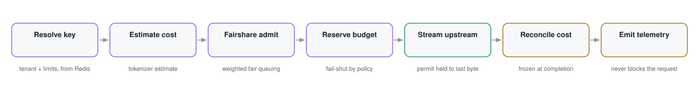
</picture>

## Verdicts: typed decisions instead of generated text

`POST /v1/verdicts` turns any registered chat model into a fast, structured decision engine. Send a **state** (a string, or structured JSON — a ticket, a document, your application's current state) plus a map of typed questions — **boolean** (yes/no), **choice** (pick one of up to 26 options), **score** (rate against 2–10 ordered levels) — and get back one typed verdict per question with a full probability distribution and a confidence, instead of prose you have to parse and hope over.

```bash
curl -sS $GATEWAY/v1/verdicts -H "Authorization: Bearer $KEY" -H 'content-type: application/json' -d '{
  "state": {"ticket": "My card was charged twice for order A-104. Please refund the duplicate."},
  "model": "auto",
  "questions": {
    "is_urgent":   {"type": "boolean", "instructions": "Does this need action today?"},
    "department":  {"type": "choice",  "instructions": "Which team should handle this?",
                    "criteria": {"billing": "Payments, refunds", "technical": "Bugs, outages"}},
    "frustration": {"type": "score",   "instructions": "How frustrated is the customer?",
                    "criteria": ["Calm", "Frustrated", "Very angry"]}
  }}'
```

No new model and no external service: the gateway answers each question with its own single-token call to the route's chat backend (`max_tokens: 1`, greedy, `top_logprobs`), reads the first-token probability distribution over a fixed set of answer labels, and renormalizes it. Probability mass that lands outside the label set lowers the reported confidence rather than corrupting the answer — a verdict is structurally incapable of coming back malformed. Questions in one request are independent and fan out concurrently against a single pinned backend replica, sharing a byte-identical prompt prefix, so with prefix caching (vLLM, SGLang) each extra question costs roughly one cache hit plus one decoded token. Verdict requests run the full pipeline — fairshare admission, budgets, telemetry (`request_type: "verdict"`), and per-question trace spans — and the dashboard playground has a Verdicts mode for trying states and questions interactively.

## Operations and health

**Health checks that match the model type.** Chat, embedding, speech, and transcription models are each verified against their real modality endpoint — a minimal inference probe, not a generic ping. Image and video models, where even a minimal generation is costly (a video render takes minutes), are checked against the upstream's model catalog instead. A rejected probe with the model still listed in the upstream's catalog is reported as a likely misconfiguration instead of an outage; a model genuinely missing upstream alerts with catalog evidence. Fixing a model's connection settings clears stale failure state and re-checks within seconds.

**Request logs you can search.** The log opens live and takes filters as you'd type them (`status:error model:… team:… key:…`); a strip charts the window with failures shown bright, and a panel counts what's in it. A request opens with a line saying what happened, a timeline of waiting for a slot, first token, and the rest, and every number. Turn tracing on for a tenant or key and each step (auth, auto route, admission, boons, upstream) is recorded by the gateway's own span recorder into ClickHouse next to usage data; OTLP export is available for Jaeger or any OpenTelemetry backend.

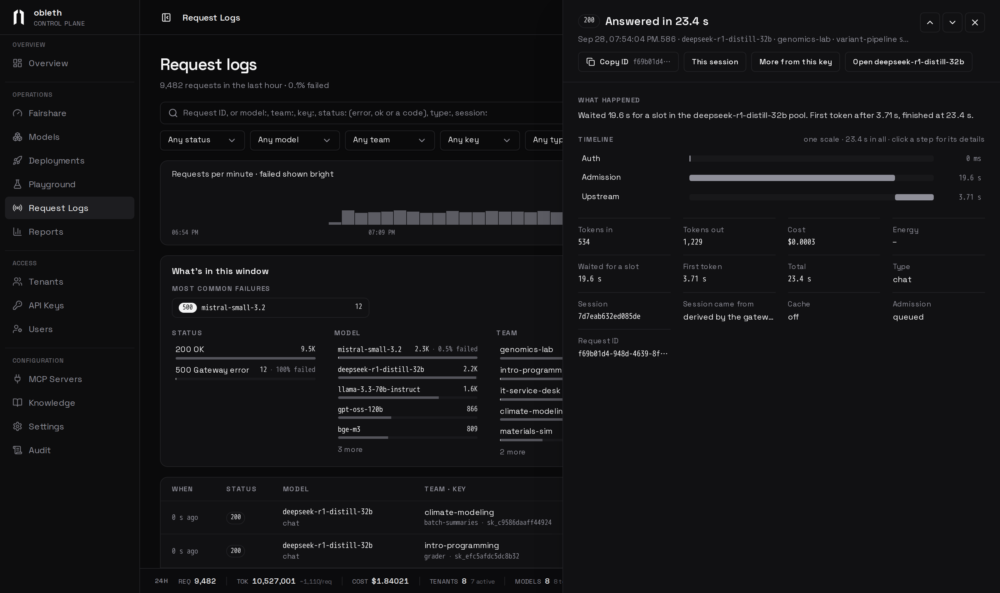

**Deployments on your own compute.** One page lists the models obleth launches on Slurm next to the Kubernetes models it watches. On Slurm, a companion provisioner talks to `slurmrestd`: pick a recipe, choose a partition (the dashboard shows whether a replica fits and how many fitting nodes are idle), review the exact script, and launch; it submits the jobs, health-probes each replica, promotes healthy ones into the routing table, and resubmits when jobs are preempted. Fresh replicas are warmed before they take traffic, and zombie jobs — RUNNING in Slurm but dead or hung at inference — are detected on two independent signals and restarted. Scale, pause, or restart from the deployment's page. When the provisioner can't reach Slurm, the dashboard says so instead of showing stale state as healthy.

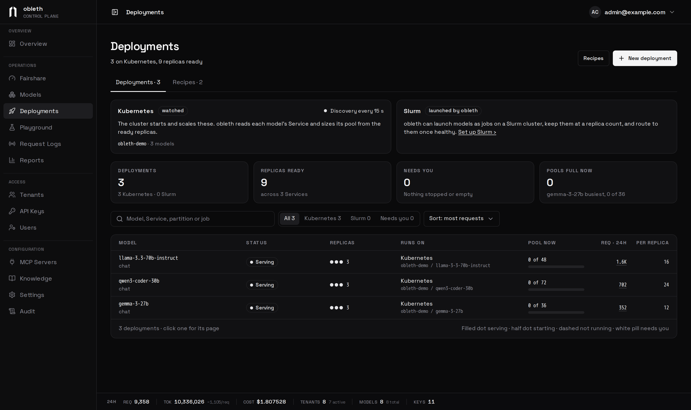

**Telemetry that survives outages.** Usage rows spill to a local write-ahead file while ClickHouse is down and replay when it returns. Spill is stored beside `OBLETH_WAL_PATH` in a `.segments` directory; persist that directory together with the original WAL when configuring volumes. Replay reads at most 500 records / 1 MiB per batch and backs off up to 60 seconds after failures. New spill is capped at 256 MiB or 1,024 files; rejected spill is logged and counted in `obleth_telemetry_dropped`. Existing WAL files are replayed first and are never truncated to enforce the cap. Corrupt or oversized legacy records are retained with an error for operator repair; they do not prevent new usage from being inserted when ClickHouse is healthy. Replay is at-least-once: a crash after insertion but before checkpointing can duplicate the last batch.

**Local-first network posture.** Private, LAN, and loopback addresses are valid upstream targets out of the box — no allowlist needed for cluster-internal endpoints. Link-local and cloud-metadata ranges are always blocked. `OBLETH_BLOCK_PRIVATE_NETWORKS=1` enables strict mode with explicit CIDR exceptions.

## Cost, energy, and chargeback

**Frozen-at-completion accounting.** Cost is computed once when a request settles and stored on the usage row. Changing prices later never rewrites history — reports stay consistent with what tenants were actually charged.

**Budgets and rate limits.** Per-tenant and per-key budgets are reserved at admission, before dispatch, and reconciled to actual usage at completion. An exhausted budget is refused with `403`. If Redis cannot run the check, `OBLETH_FAIL_OPEN` decides: the default admits the request and raises an alert, `false` refuses it with `503`.

**Energy and carbon per request.** Point the gateway at your Prometheus with any PromQL expression returning per-node power — Habana, DCGM, and IPMI exporters all work — and each request is charged its wall-time share of a serving slot's draw: watt-hours, electricity cost, and CO₂, recorded next to token cost. Queue time is never charged and idle power is never attributed, so totals understate rather than overstate. Off by default; if Prometheus is unreachable, requests are never delayed.

**Chargeback reports.** Pick a period (7 or 30 days, this or last month, or any range) and filter by team, key and model: five totals against the previous period, one chart split by team or model, the teams and models that cost the most, and a breakdown by day, team, key or model that ends in a totals row. Every number links to the requests behind it, and exports preview their first rows before the download.

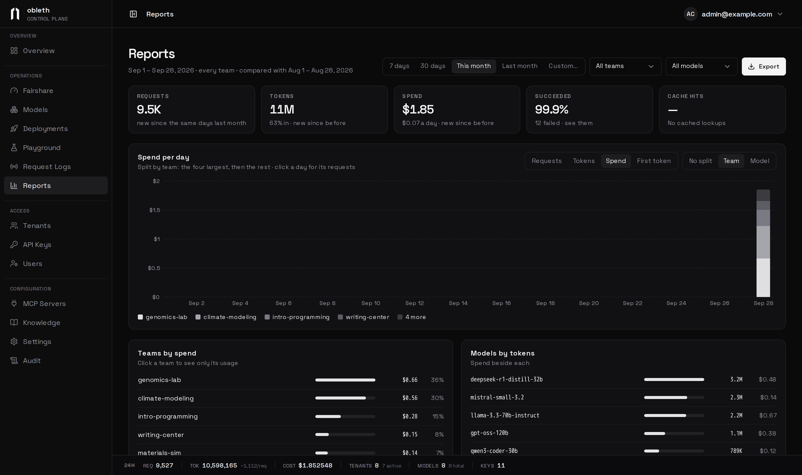

## The dashboard

Every page leads with what needs attention and saves with one bar where settings are edited. Models is a searchable table with a page per model; Fairshare leads with the model pools, who is waiting, and why; Tenants and API keys show each tenant's use, budget and limits, and keys can move between tenants; Settings opens on anything that needs you.

<table>
  <tr>
    <td>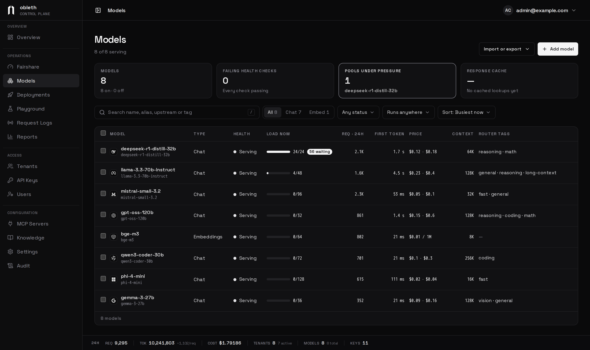</td>
    <td>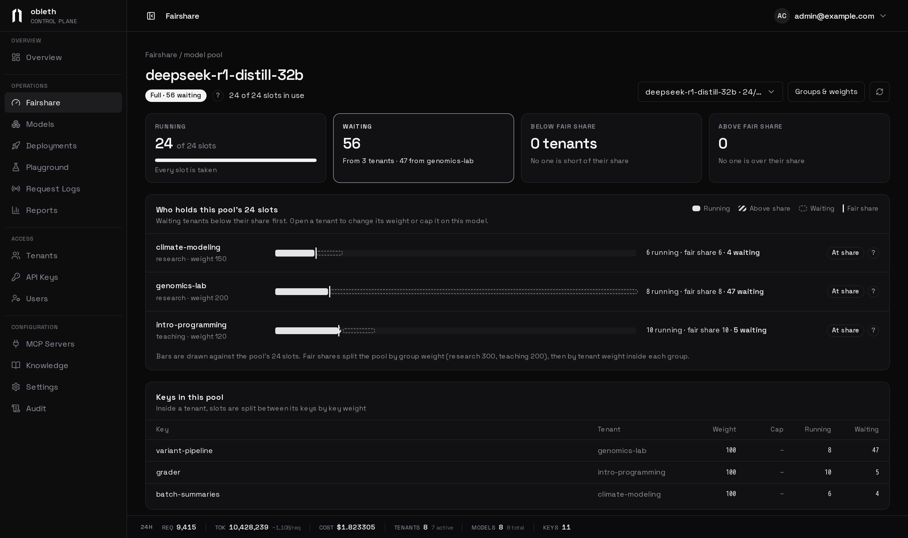</td>
  </tr>
  <tr>
    <td>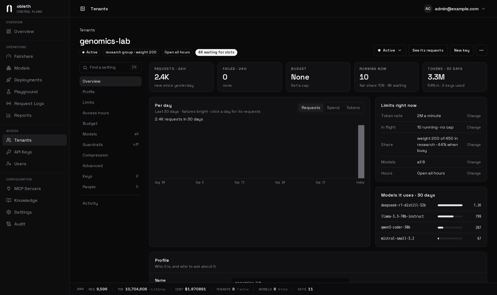</td>
    <td>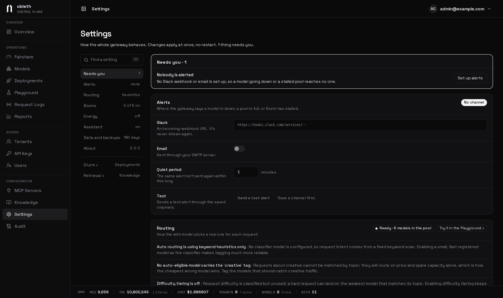</td>
  </tr>
</table>

## Benchmarking and testing

**`obench score`.** A graded readiness scorecard for the whole deployment. Six sections — capacity ramp, gateway overhead, streaming quality, overload behavior, resilience (fault-injected MTTD/MTTR), and fairshare dynamics — roll up into a weighted, letter-graded report. Scores are stored as baselines and diffed on later runs to catch regressions. A GPU-free fixture backend ships in the compose stack, so the full suite runs without touching real models.

**Playground.** One workspace for trying the gateway: chat with one model or compare several side by side (each answer reports time to first token, tokens per second, tokens, cost and a link to its trace), see how `auto` would route a prompt, generate images, and build Verdicts questions. Get code turns the current request into cURL, Python, or JavaScript. The built-in assistant can check a new model's capabilities, verify MCP servers end to end, or run a concurrency-ramp benchmark with a graded capacity curve, inline in the conversation.

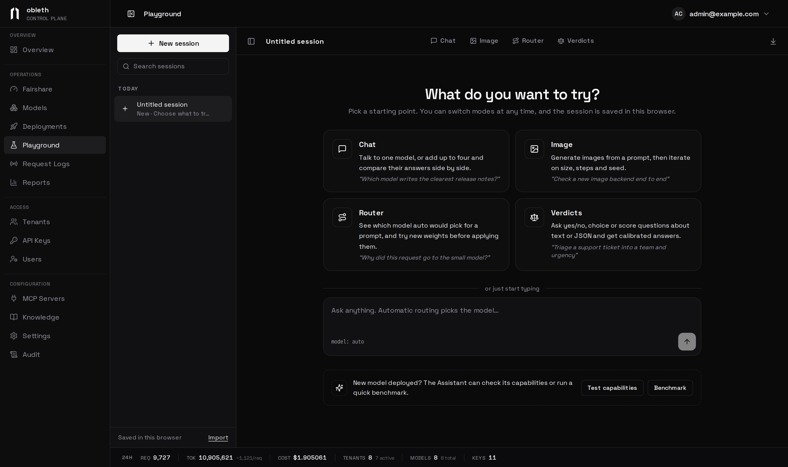

**Synthetic tenants.** Tenants can be flagged synthetic (obench seeds its fixture tenants that way). Their traffic is recorded as benchmark traffic and, together with health probes, excluded from usage and cost statistics by default — test runs never pollute the numbers you bill against.

## Quick start (Docker)

```bash
cd deploy/docker
cp .env.example .env          # dev defaults — change passwords before exposing to a network
docker compose up -d
```

`.env.example` enables the full dev/demo stack (`benchmark`, `edge`, and `observability` profiles), so everything starts with a single command. To build from source instead of pulling published images, add `--build`.

Once the containers are healthy:

| Service | URL | Default login |
| --- | --- | --- |
| Dashboard | <http://localhost:3002> | `admin@example.com` / `obleth-admin` |
| Gateway (via HAProxy) | <http://localhost> | — |
| Gateway (direct) | <http://localhost:8088> | — |
| Grafana | <http://localhost:3001> | `admin` / `obleth` |
| Prometheus | <http://localhost:9090> | — |
| Jaeger traces | <http://localhost:16686> | — |

The dashboard login comes from `DASHBOARD_ADMIN_EMAIL` and `DASHBOARD_PASSWORD` in your `.env`; OIDC SSO (Globus, CILogon, or any discovery-capable provider) is also supported. If you are upgrading from a pre-v0.5.0 username login, set `DASHBOARD_ADMIN_EMAIL` before upgrading — see the [Dashboard SSO guide](https://obleth.com/docs/guides/dashboard-sso).

Log in to register models, create tenants and API keys, configure fairshare weights, and monitor usage. The benchmark fixture backend is pre-registered as the default upstream, so the UI is explorable immediately without a GPU endpoint. Models can also be imported in bulk from any OpenAI-compatible provider's catalog.

## Deployment

obleth ships as Docker Compose (above), a Helm chart for Kubernetes, and pre-built binaries. Versions are released in lockstep across the gateway, dashboard, provisioner, and chart. See **[obleth.com](https://obleth.com)** for deployment guides, the configuration reference, and production setup.

## Documentation

Architecture, scheduler internals, Slurm provisioner setup, auto routing and the classifier, budgets, boons, compression, energy accounting, MCP integration, alerting, and the configuration reference live at **[obleth.com](https://obleth.com)**.

## Contributing

Bug reports and feature requests go in [GitHub Issues](https://github.com/thediymaker/obleth-gateway/issues). Pull requests are welcome — see [CONTRIBUTING.md](CONTRIBUTING.md) for the development workflow. For security vulnerabilities, follow the responsible disclosure process in [SECURITY.md](SECURITY.md).

## License

[Business Source License 1.1](LICENSE). Source-available; each release converts to [Apache 2.0](https://www.apache.org/licenses/LICENSE-2.0) four years after publication. Free for internal, academic, research, and educational use. You may not offer obleth as a hosted service or distribute a competing gateway product derived from it until the Change Date. Contact the maintainers for commercial licensing.
